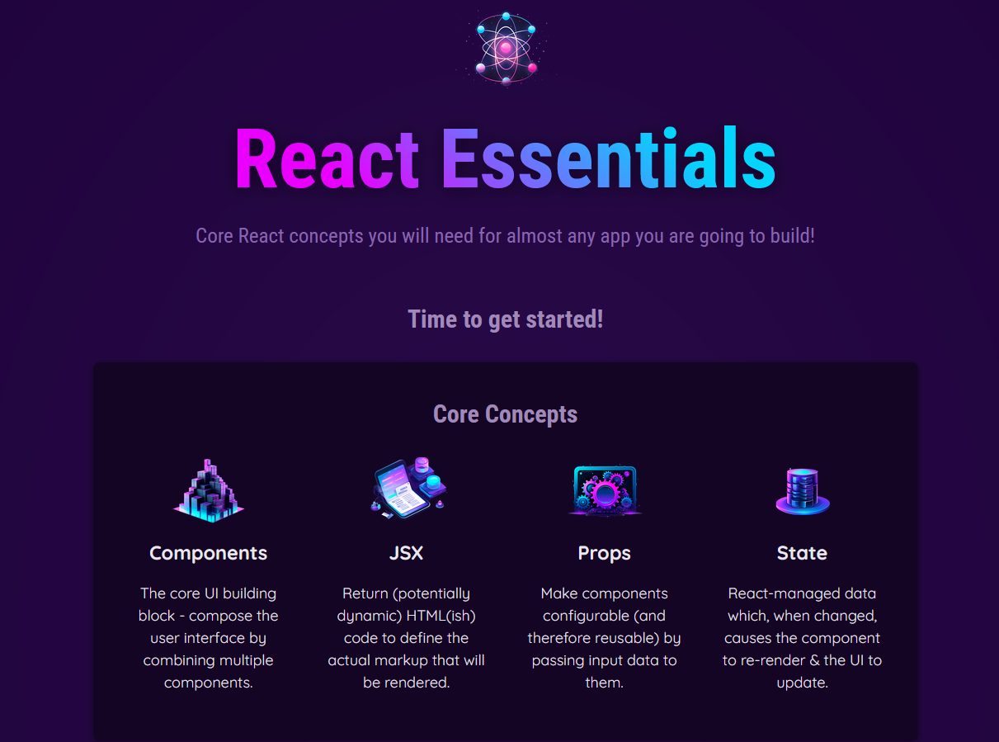
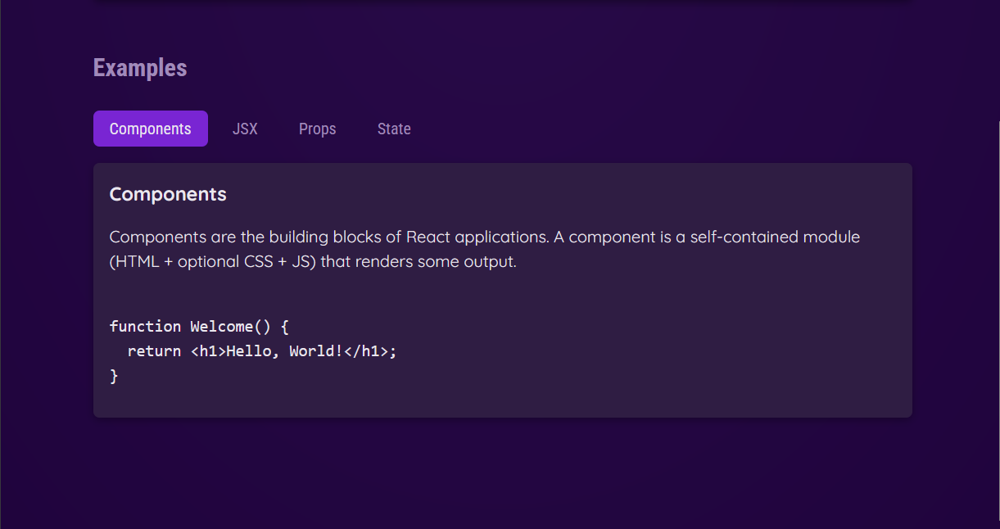

# React Essentials

Welcome to the **React Essentials** project! This repository covers the essential concepts to get started with React and create dynamic applications. Topics include Components, JSX, Props, and State, as well as styling, dynamic data output, dynamic listing, and the standard structure of React projects.

## Table of Contents

- [Introduction](#introduction)
- [Features](#features)
- [Getting Started](#getting-started)
  - [Prerequisites](#prerequisites)
  - [Installation](#installation)
- [Screenshots](#screenshots)

## Introduction

This project is designed to teach you the fundamentals of React, including how to create and manage components, work with JSX, handle props and state, and apply styling. By the end of this project, you'll be able to build dynamic and interactive web applications using React.

## Features

- **Components**: Learn how to create reusable components.
- **JSX**: Understand how JSX makes it easier to write and understand your React code.
- **Props and State**: Manage data and interactions within your components.
- **Styling**: Apply styles to your components.
- **Dynamic Data Output**: Render data dynamically in your application.
- **Dynamic Listing**: Create dynamic lists based on your data.
- **Project Structure**: Follow best practices for structuring your React projects.

## Getting Started

### Prerequisites

Make sure you have the following installed on your machine:

- [Node.js](https://nodejs.org/)
- [npm](https://www.npmjs.com/)

### Installation

1. Clone the repository:
   ```bash
   git clone https://github.com/yourusername/react-essentials.git

2. Navigate to the project directory:
   ```bash
   cd react-essentials

3. Install the dependencies:
   ```bash
   npm install

4. Running the Project
   ```bash
   npm run dev

This will start the development server, and you can view the application in your browser at http://localhost:5173.

## Screenshots


